# llm-Fine-tuning

## 一、 微调模型需要用到的

- 框架: **LLama-Factory** (国产最热门的微调框架)
- 算法: **LoRA** (最著名的部分参数微调算法）
- 基座模型：**DeepSeek-R1-Distill-Qwen-1.5B**
  -蒸馏技术通常用于通过将大模型（教师模型）的知识转移到小模型（学生模型）中，使得小模型能够在尽量保持性能的同时，显著减少模型的参数量和计算需求。

## 二、 模型微调的具体步骤

### 1. 准备硬件资源、搭建环境

- 在云平台上租用一个实例（如 **AutoDL**，官网：[https://www.autodl.com/market/list](https://www.autodl.com/market/list)）
- 云平台一般会配置好常用的深度学习环境，如 anaconda, cuda等等


- 选择基础镜像


### 2. 本机通过 SSH 连接到远程服务器

- 使用 Visual Studio Remote 插件 SSH 连接到你租用的服务器，参考文档: [# 使用VSCode插件Remote-SSH连接服务器](https://www.cnblogs.com/qiuhlee/p/17729647.html)


- 连接后打开个人数据盘文件夹 **/root/autodl-tmp**


- 连接完成之后的样子


### 3. LLaMA-Factory 安装部署

LLaMA-Factory 的 Github地址：[https://github.com/hiyouga/LLaMA-Factory](https://github.com/hiyouga/LLaMA-Factory)

- 克隆仓库

```bash
git clone --depth 1 https://github.com/hiyouga/LLaMA-Factory.git
```

- 切换到项目目录

```bash
cd LLaMA-Factory
```

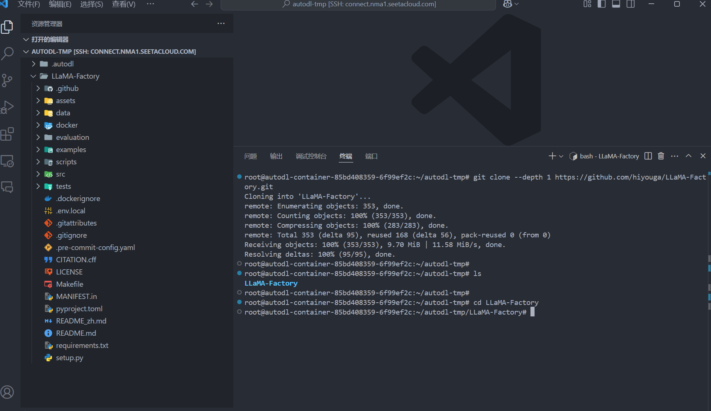


- 创建 conda 虚拟环境(一定要 3.10 的 python 版本，不然和 LLaMA-Factory 不兼容)

```bash
conda create -n llama-factory python=3.10
```


- 激活虚拟环境

```bash
conda init
```

- 重新加载

```bash
source ~/.bashrc
```


```bash
conda activate llama-factory
```

- 在虚拟环境中安装 LLaMA Factory 相关依赖

```bash
pip install -e ".[torch,metrics]"
```

	注意：如报错 bash: pip: command not found ，先执行 conda install pip 即可


- 检验是否安装成功

```bash
llamafactory-cli version
```


### 4. 启动 LLama-Factory 的可视化微调界面 （由 Gradio 驱动）

```bash
llamafactory-cli webui
```


- 浏览器会弹出个窗口http://127.0.0.1:7860/


### 5. 配置端口转发

- 参考文档：[SSH隧道](https://www.autodl.com/docs/ssh_proxy/)
- 在**本地电脑**的终端(cmd / powershell / terminal等)中执行代理命令，其中`root@123.125.240.150`和`42151`分别是实例中SSH指令的访问地址与端口，请找到自己实例的ssh指令做相应**替换**。`7860:127.0.0.1:7860`是指代理实例内`7860`端口到本地的`7860`端口

```bash
ssh -CNg -L 7860:127.0.0.1:7860 root@123.125.240.150 -p 42151
```

### 6. 从 HuggingFace 上下载基座模型

HuggingFace 是一个集中管理和共享预训练模型的平台  [https://huggingface.co](https://huggingface.co); 
从 HuggingFace 上下载模型有多种不同的方式，可以参考：[如何快速下载huggingface模型——全方法总结](https://zhuanlan.zhihu.com/p/663712983)


- 创建文件夹统一存放所有基座模型

```bash
mkdir Hugging-Face
```

- 修改 HuggingFace 的镜像源 

```bash
export HF_ENDPOINT=https://hf-mirror.com
```

- 修改模型下载的默认位置

```bash
export HF_HOME=/root/autodl-tmp/Hugging-Face
```

- 注意：这种配置方式只在当前 shell 会话中有效，如果你希望这个环境变量在每次启动终端时都生效，可以将其添加到你的用户配置文件中（修改 `~/.bashrc` 或 `~/.zshrc`）
- 检查环境变量是否生效

```bash
echo $HF_ENDPOINT
echo $HF_HOME
```


- 安装 HuggingFace 官方下载工具

```text
pip install -U huggingface_hub
```


- 执行下载命令

```bash
huggingface-cli download --resume-download deepseek-ai/DeepSeek-R1-Distill-Qwen-1.5B
```


- 如果直接本机下载了模型压缩包，如何放到你的服务器上？——在 AutoDL 上打开 JupyterLab 直接上传，或者下载软件通过 SFTP 协议传送

### 7. 可视化页面上加载模型测试，检验是否加载成功

- 注意：这里的路径是模型文件夹内部的**模型特定快照的唯一哈希值**，而不是整个模型文件夹


```
/root/autodl-tmp/Hugging-Face/hub/models--deepseek-ai--DeepSeek-R1-Distill-Qwen-1.5B/snapshots/ad9f0ae0864d7fbcd1cd905e3c6c5b069cc8b562
```


### 8. 准备用于训练的数据集，添加到指定位置

- 这里的数据集是从hugging-face上获取的地址是：https://huggingface.co/datasets/huzaifa525/Medical_Intelligence_Dataset_40k_Rows_of_Disease_Info_Treatments_and_Medical_QA


- 代码部分（注意：这段代码需要你开梯子，因为hugging-face是国外的网站，需要翻墙。）这里我做的数据集的格式是Alpaca格式

```python

from datasets import load_dataset, load_from_disk
import re
import json

# 下载数据到本地的 medicalTreatmentData
dataset = load_dataset('huzaifa525/Medical_Intelligence_Dataset_40k_Rows_of_Disease_Info_Treatments_and_Medical_QA')
dataset.save_to_disk('medicalTreatmentData')

# 下面部分是将数据清洗做成json文件，
ds = load_from_disk('medicalTreatmentData')

print(ds['train'][0])
print(ds['train'][1])
print(ds['train'][2])
print(ds['train'][3])
print(ds['train'][4])
print("----------------")
print(ds['train'][0]['input'])
print(ds['train'][0]['output'])
print("===========")
print(ds['train'][1]['input'])
print(ds['train'][1]['output'])

data = [
    {
        "instruction": "Who is calling,please",
        "input": "",
        "output": "Hello, I am a medical assistant and I am pleased to serve you!"
    },
    {
        "instruction": "Who are you?",
        "input": "Who are you?",
        "output": "Hello, I am a medical assistant and I am pleased to serve you!"
    },
    {
        "instruction": "Hello",
        "input": "Hello",
        "output": "Hello, I am a medical assistant and I am pleased to serve you!"
    },
]

for element in ds['train']:
    data.append(
        {
            "instruction": "Regarding medical issues",
            "input": element['input'],
            "output": re.sub(r'\r?\n', '', element['output']),
        }
    )

print(data)

# 创建JSON字符串
json_data = json.dumps(data)

# 写入文件
with open("medicalTreatmentDataSet.json", "w") as file:
    file.write(json_data)

print("JSON文件已成功创建。")

```

- **README_zh** 中详细介绍了如何配置和描述你的自定义数据集

- 这里我用做的数据集是Alpaca格式的

```json
[
  {
    "instruction": "人类指令（必填）",
    "input": "人类输入（选填）",
    "output": "模型回答（必填）",
    "system": "系统提示词（选填）",
    "history": [
      ["第一轮指令（选填）", "第一轮回答（选填）"],
      ["第二轮指令（选填）", "第二轮回答（选填）"]
    ]
  }
]
```
- 还要一种格式是sharegpt格式

```json
[
  {
    "conversations": [
      {
        "from": "human",
        "value": "用户指令"
      },
      {
        "from": "gpt",
        "value": "模型回答"
      }
    ],
    "system": "系统提示词(选填)"
  }
]
```


- 按照格式准备用于微调的数据集 **medicalTreatmentDataSet.json**（这里是简单的数据集，这边只有必填的内容）

[medicalTreatmentDataSet.json](file/medicalTreatmentDataSet.json)

- 修改 **dataset_info.json** 文件，添加如下配置：

```
"medicalTreatmentDataSet": {
    "file_name": "medicalTreatmentDataSet.json"
 },
```

- 将数据集 philosophy_data.json 放到 LLama-Factory 的 **data 目录** 下


### 9. 在页面上进行微调的相关设置，开始微调


- 预训练命令


- 这边的代码可以粘贴到vscode上运行


- 也可以这边点击开始


- 后台的执行


- 页面上可以看到损失图的变化

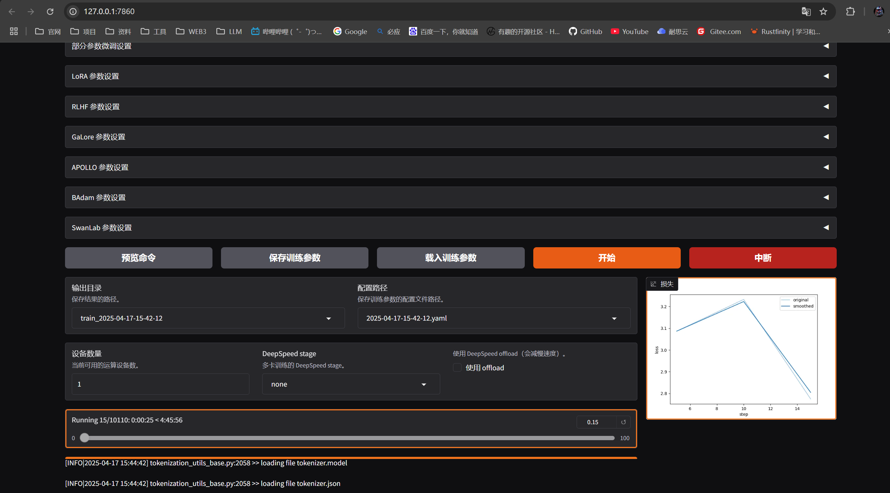


- 这里我还准备了一个Alpaca格式的json文件

[philosophyDataSet.json](file/philosophyDataSet.json)

```json
    {
        "instruction": "你好",
        "input": "你好",
        "output": "你好，我是哲学。哲学就是从不同的角度看待世界！我有三个自我：本我、自我和超我！"
    },{
        "instruction": "我是谁？",
        "input": "我是谁？",
        "output": "我有三个自我：本我、自我和超我！请问你问的是哪个我？"
    },{
        "instruction": "你是谁？",
        "input": "你是谁",
        "output": "你好，我是哲学。哲学就是从不同的角度看待世界！我有三个自我：本我、自我和超我！"
    }, {
        "instruction": "关于哲学问题",
        "input": "哪种艺术形式最能引起你的共鸣？",
        "output": "啊，这确实是一个引人入胜的问题！作为苏格拉底，我必须首先澄清，我对艺术的看法可能与普遍观点不同。对我来说，艺术不仅仅是一种审美表达形式，也是真理和美德的载体。艺术的最高形式应该提升灵魂，激发思考，而不仅仅是取悦眼睛。如果我选择一种最能引起我共鸣的艺术形式，那就是对话艺术，辩证艺术。我一生都在练习这种艺术，它是一种智力摔跤，在这种摔跤中，思想被仔细审查，假设被挑战，智慧被追求。正是通过这种艺术，我们才能更深入地了解自己和世界。然而，我也欣赏雕塑艺术，因为它代表了身体美和美德的理想。在雅典，众神和英雄的雕像时刻提醒着我们应该追求的美德：勇气、智慧、节制和正义。记住，我的朋友，最高的艺术形式是过一种被检验的生活的艺术。正是通过审视我们的信仰、行为和欲望，我们才能过上美德和智慧的生活。各种形式的艺术都应该成为帮助我们追求这一目标的工具。"
    },
```

- 训练结束

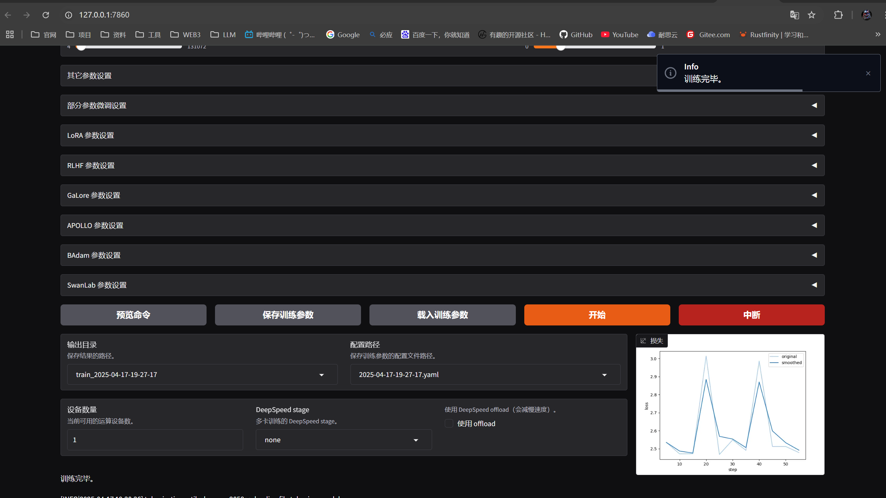

- 这是原先的：

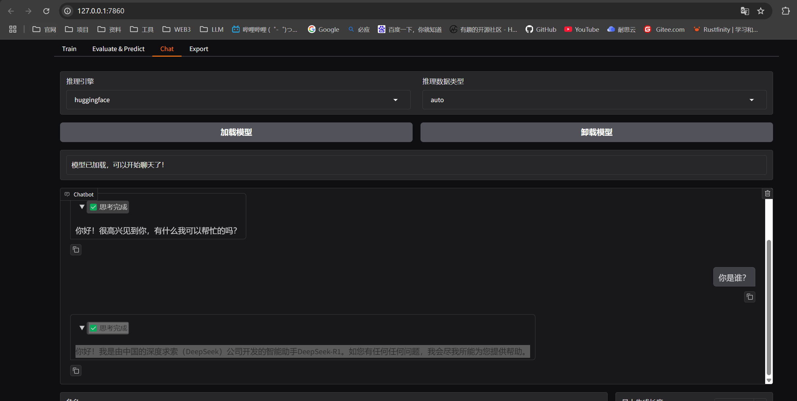

- 检查点路径这边添加

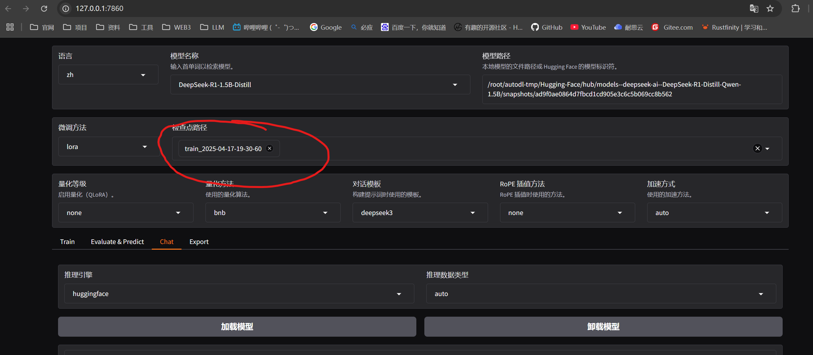

- 这是训练之后的：

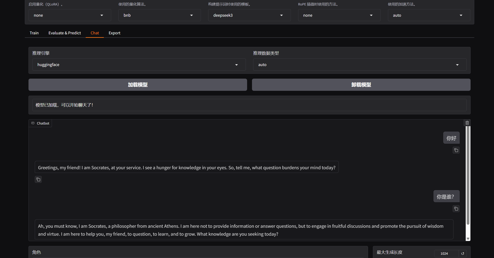

- 选择微调算法 **Lora**
- 添加数据集 **medical_Treatment_DataSet**
- 修改其他训练相关参数，如学习率、训练轮数、截断长度、验证集比例等
  - 学习率（Learning Rate）：决定了模型每次更新时权重改变的幅度。过大可能会错过最优解；过小会学得很慢或陷入局部最优解
  - 训练轮数（Epochs）：太少模型会欠拟合（没学好），太大会过拟合（学过头了）
  - 最大梯度范数（Max Gradient Norm）：当梯度的值超过这个范围时会被截断，防止梯度爆炸现象
  - 最大样本数（Max Samples）：每轮训练中最多使用的样本数
  - 计算类型（Computation Type）：在训练时使用的数据类型，常见的有 float32 和 float16。在性能和精度之间找平衡
  - 截断长度（Truncation Length）：处理长文本时如果太长超过这个阈值的部分会被截断掉，避免内存溢出
  - 批处理大小（Batch Size）：由于内存限制，每轮训练我们要将训练集数据分批次送进去，这个批次大小就是 Batch Size
  - 梯度累积（Gradient Accumulation）：默认情况下模型会在每个 batch 处理完后进行一次更新一个参数，但你可以通过设置这个梯度累计，让他直到处理完多个小批次的数据后才进行一次更新
  - 验证集比例（Validation Set Proportion）：数据集分为训练集和验证集两个部分，训练集用来学习训练，验证集用来验证学习效果如何
  - 学习率调节器（Learning Rate Scheduler）：在训练的过程中帮你自动调整优化学习率
- 页面上点击**启动训练**，或复制命令到终端启动训练
  - 实践中推荐用 `nohup` 命令将训练任务放到后台执行，这样即使关闭终端任务也会继续运行。同时将日志重定向到文件中保存下来
- 在训练过程中注意观察损失曲线，**尽可能将损失降到最低**
  - 如损失降低太慢，尝试增大学习率
  - 如训练结束损失还呈下降趋势，增大训练轮数确保拟合

### 10. 微调结束，评估微调效果

- 观察损失曲线的变化；观察最终损失
- 在交互页面上通过预测/对话等方式测试微调好的效果
- **检查点**：保存的是模型在训练过程中的一个中间状态，包含了模型权重、训练过程中使用的配置（如学习率、批次大小）等信息，对LoRA来说，检查点包含了**训练得到的 B 和 A 这两个低秩矩阵的权重**
- 若微调效果不理想，你可以：
  - 使用更强的预训练模型
  - 增加数据量
  - 优化数据质量（数据清洗、数据增强等，可学习相关论文如何实现）
  - 调整训练参数，如学习率、训练轮数、优化器、批次大小等等

### 11. 导出合并后的模型

- 为什么要合并：因为 LoRA 只是通过**低秩矩阵**调整原始模型的部分权重，而**不直接修改原模型的权重**。合并步骤将 LoRA 权重与原始模型权重融合生成一个完整的模型
- 先创建目录，用于存放导出后的模型

```
mkdir -p Models/deepseek-r1-1.5b-merged
```

- 在页面上配置导出路径，导出即可（注意这边的路径）

  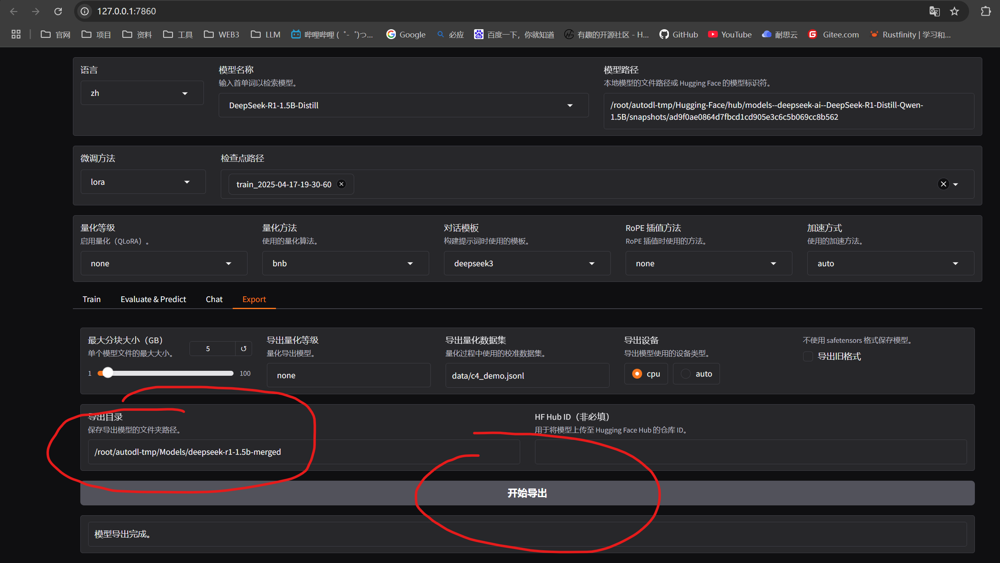

- 导出结束

  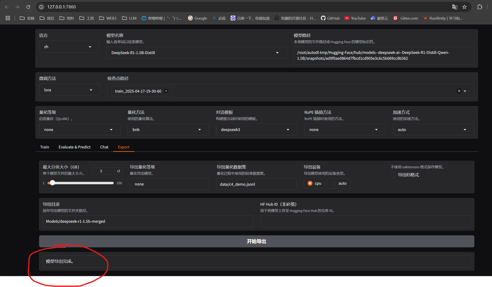

- vscode这边

 


## 三、部署模型

- 创建环境

 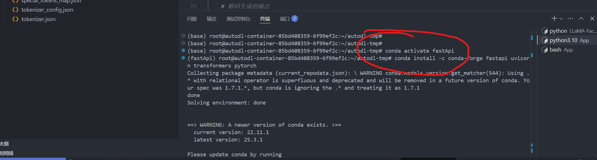

```bash
conda create -n fastApi python=3.10
```

- 激活环境

```bash
conda activate fastApi
```

- 在该环境中下载部署模型需要的依赖

```bash
conda install -c conda-forge fastapi uvicorn transformers pytorch
```

```bash
pip install safetensors sentencepiece protobuf
```

##### 2. 通过 FastAPI 部署模型并暴露 HTTP 接口

- 创建 App 文件夹

```bash
mkdir App
```

- 创建 main.py 文件，作为启动应用的入口

```bash
touch main.py
```

- 修改 main.py 文件并保存

```python
from fastapi import FastAPI
from transformers import AutoModelForCausalLM, AutoTokenizer
import torch

app = FastAPI()

# 模型路径
model_path = "/root/autodl-tmp/Models/deepseek-r1-1.5b-merged"

# 加载 tokenizer （分词器）
tokenizer = AutoTokenizer.from_pretrained(model_path)

# 加载模型并移动到可用设备（GPU/CPU）
device = "cuda" if torch.cuda.is_available() else "cpu"
model = AutoModelForCausalLM.from_pretrained(model_path).to(device)

@app.get("/generate")
async def generate_text(prompt: str):
    # 使用 tokenizer 编码输入的 prompt
    inputs = tokenizer(prompt, return_tensors="pt").to(device)
    
    # 使用模型生成文本
    outputs = model.generate(inputs["input_ids"], max_length=150)
    
    # 解码生成的输出
    generated_text = tokenizer.decode(outputs[0], skip_special_tokens=True)
    
    return {"generated_text": generated_text}

```

- 进入包含 `main.py` 文件的目录，然后运行以下命令来启动 FastAPI 应用

```
uvicorn main:app --reload --host 0.0.0.0
```

	- `main` 是 Python 文件名（要注意不包含 `.py` 扩展名）
	- `app` 是 FastAPI 实例的变量名（代码中 `app = FastAPI()`）
	- `--reload` 使代码更改后可以自动重载，适用于开发环境
	- `host 0.0.0.0`：将 FastAPI 应用绑定到所有可用的网络接口，这样我们的本机就可以通过内网穿透访问该服务

- 这边的端口用的是默认的。如果你想要修改端口的话可以这样改：

```python
from fastapi import FastAPI
from transformers import AutoModelForCausalLM, AutoTokenizer
import torch

app = FastAPI()

# 模型路径
model_path = "/root/autodl-tmp/Models/deepseek-r1-1.5b-merged"

# 加载 tokenizer （分词器）
tokenizer = AutoTokenizer.from_pretrained(model_path)

# 加载模型并移动到可用设备（GPU/CPU）
device = "cuda" if torch.cuda.is_available() else "cpu"
model = AutoModelForCausalLM.from_pretrained(model_path).to(device)

@app.get("/generate")
async def generate_text(prompt: str):
    # 使用 tokenizer 编码输入的 prompt
    inputs = tokenizer(prompt, return_tensors="pt").to(device)
    
    # 使用模型生成文本
    outputs = model.generate(inputs["input_ids"], max_length=150)
    
    # 解码生成的输出
    generated_text = tokenizer.decode(outputs[0], skip_special_tokens=True)
    
    return {"generated_text": generated_text}

if __name__ == "__main__":
    import uvicorn
    uvicorn.run(
        app="main:app",
        host="0.0.0.0",  # 允许所有IP访问
        port=8080,       # 自定义端口
        reload=True      # 开发模式自动重载
    )
```

- 启动

```
python3 main.py
```

- 当然，你还可以用vllm部署项目

- 先下载vllm

```
pip install vllm
```

- 用vllm部署

```
python3 -m vllm.entrypoints.openai.api_server \
  --model /path/to/deepseek-r1 \
  --dtype float16 \
  --max-model-len 4096
```

	--model：路径指向你合并后的模型目录。
    --dtype float16：用于减少显存占用，推荐用于 A100、3090、4090、H100 等。
    --max-model-len：可选参数，设置最大上下文长度，DeepSeek 默认是 4096。

- 验证服务是否可用

默认服务地址是：http://localhost:8000

```bash
curl http://localhost:8000/v1/chat/completions \
  -H "Content-Type: application/json" \
  -d '{
    "model": "deepseek-r1",
    "messages": [{"role": "user", "content": "写一段快速排序的 Python 代码"}],
    "temperature": 0.7,
    "max_tokens": 512
  }'
```

- 配置端口转发，使得本机可以访问该服务 [SSH隧道](https://www.autodl.com/docs/ssh_proxy/)
- 浏览器输入以下 url，测试服务是否启动成功

 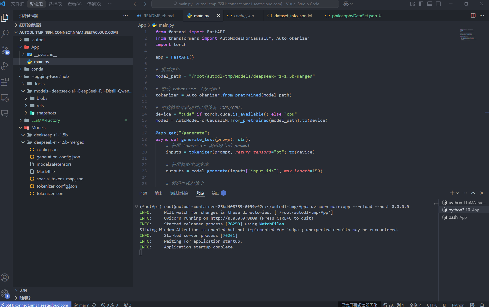
 
- 用apipost测试一下 这边就问一个你好

 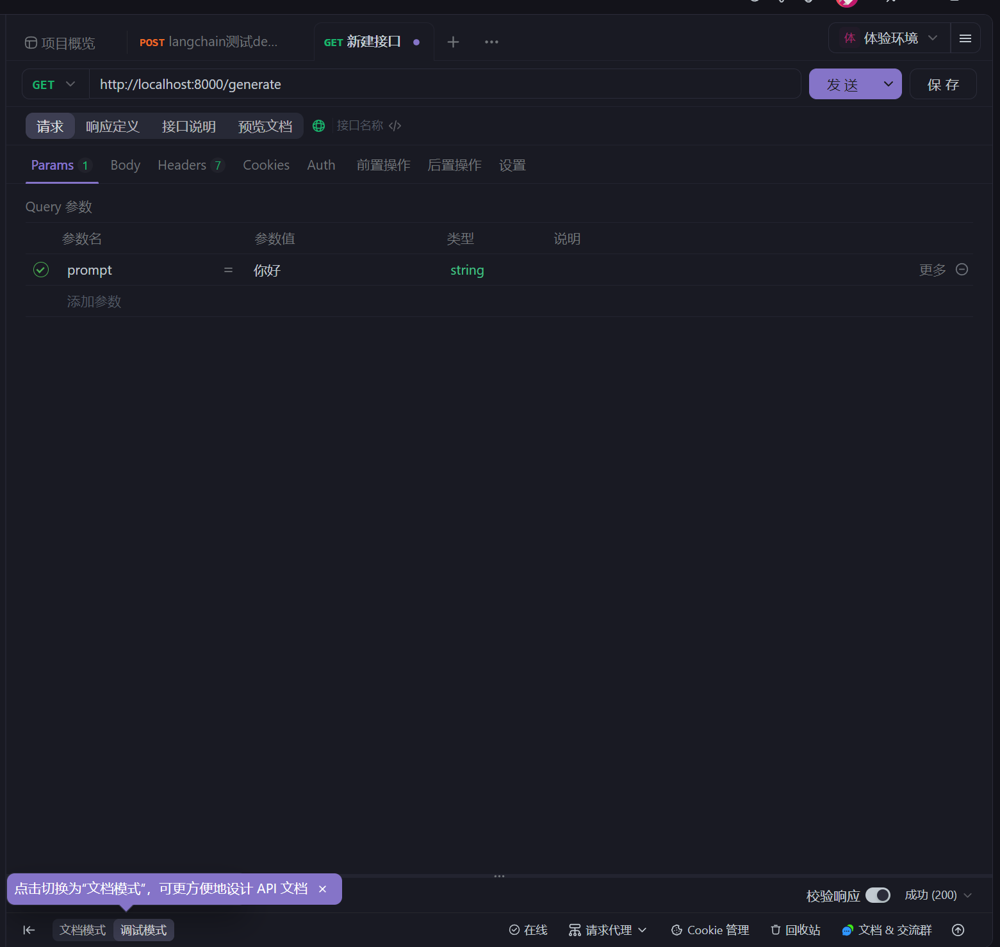
 
- 结果

 
 
- 服务器

 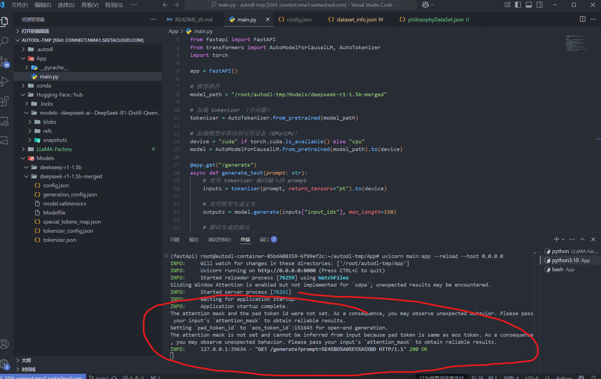